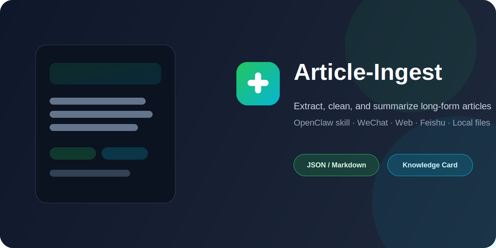

# Article-Ingest

<p align="center">
  
</p>


An OpenClaw skill for extracting, cleaning, and summarizing long-form articles from multiple input sources.

It is designed for the common workflow of **“send me an article, give me the useful bits, and optionally turn it into a reusable knowledge note.”**

> 中文一句话：把公众号文章、网页、Feishu 文档、本地文本等输入，整理成可读摘要和可复用知识卡片。

## Quick links

- [Latest release](https://github.com/wwb1942/Article-Ingest/releases/latest)
- [Download packaged skill](https://github.com/wwb1942/Article-Ingest/releases/latest/download/article-ingest.skill)
- [Skill contract](./SKILL.md)
- [Output templates](./references/output-templates.md)
- [Changelog](./CHANGELOG.md)
- [Contributing guide](./CONTRIBUTING.md)

## When to use

Use `Article-Ingest` when you want to:

- summarize a WeChat article quickly
- turn a long webpage into a structured digest
- normalize text from local markdown / txt / html files
- extract article content first, then hand it to another summarization or archival workflow
- turn reading into reusable notes instead of one-off chat answers

## When not to use

This repository is **not** the best fit when you need:

- dedicated PDF parsing / OCR as the main workflow
- fully general document conversion across many office formats
- heavy browser automation for login-gated sites
- a full publishing pipeline by itself

In those cases, extract the text first or combine this skill with other tools.

## What it supports

- WeChat `mp.weixin.qq.com` article links
- Generic web URLs
- Local `md` / `txt` / `html` files
- Pasted raw text / stdin
- Feishu docs via `feishu-doc` workflow integration

## Default output

Unless a custom format is requested, the skill is designed to produce:

1. 3-line summary
2. Core points
3. Judgment / worth-reading note
4. Whether it is worth remembering
5. Topic tags

## Quick examples

### Extract from a WeChat article

```bash
python3 scripts/article_ingest.py 'https://mp.weixin.qq.com/s/...' --format json
```

### Extract from a local markdown file

```bash
python3 scripts/article_ingest.py '/path/to/article.md' --format json
```

### Extract from pasted text / stdin

```bash
cat article.txt | python3 scripts/article_ingest.py --stdin --title 'Temporary title' --format json
```

### Show CLI help

```bash
python3 scripts/article_ingest.py --help
```

## Output formats

The extraction script supports:

- `json`
- `markdown`
- `text`

## Example JSON shape

```json
{
  "title": "Example article title",
  "author": "Example author",
  "description": "Short extracted description",
  "text": "Cleaned article body text..."
}
```

## Example digest shape

```markdown
**3-line summary**
- Line 1
- Line 2
- Line 3

**Core points**
1. Point one
2. Point two
3. Point three

**My judgment**
- Worth attention: yes / no / partial
- Why: short explanation
```

## Repository layout

- `SKILL.md` — skill contract, workflow guidance, and guardrails
- `scripts/article_ingest.py` — extraction entrypoint
- `references/output-templates.md` — digest and knowledge-card templates
- `dist/article-ingest.skill` — packaged skill artifact
- `CHANGELOG.md` — release notes and notable changes
- `CONTRIBUTING.md` — contribution guide

## Installation notes

If you just want the packaged artifact, download `article-ingest.skill` from the latest GitHub release.

If you want to inspect or adapt behavior, start from:

- `SKILL.md`
- `scripts/article_ingest.py`
- `references/output-templates.md`

## Notes

- The repository display name is `Article-Ingest`, but the technical skill slug remains `article-ingest`.
- Keeping the slug lowercase avoids breaking skill references, file paths, and packaged artifact naming.
- This repository is a standalone export of the skill from a larger OpenClaw workspace.

## License

MIT
